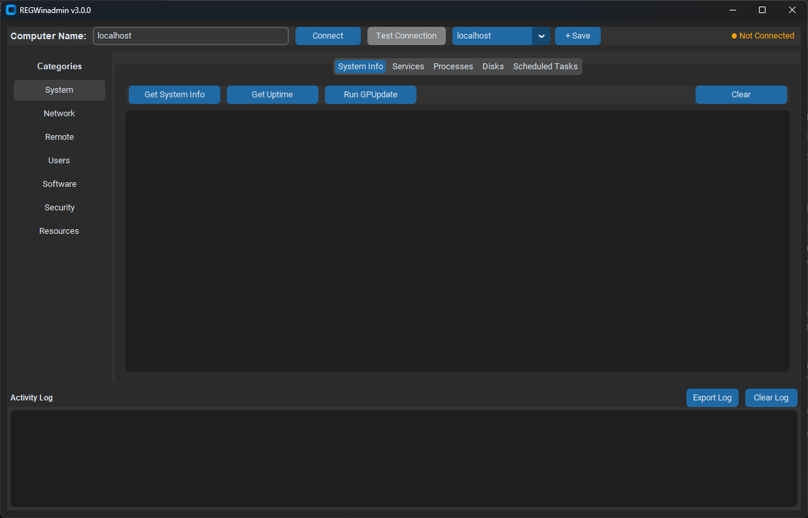

# REGWinadmin

A free, dark-mode **Windows administration GUI** for Windows 10/11 and Windows Server 2019/2022+. Manage the local machine or remote computers (WinRM): system info, services, processes, network, disks, users, software, security and resources from one window.

> A Python port and extension of the ideas in the open-source [LazyWinAdmin](https://github.com/lazywinadmin/LazyWinAdmin_GUI) PowerShell tool by Francois-Xavier Cat (MIT license), with a modern CustomTkinter interface and extra features. Credit and thanks to the original author.

## Screenshots


*Category sidebar, per-category tabs and activity log*

## Features

- **System** - hardware/OS info, uptime, Group Policy update (local or remote)
- **Network** - adapters, port testing, connectivity tests
- **Remote** - enable/disable RDP, NLA, firewall rules, status check
- **Users** - local users/groups and Active Directory users, groups, computers
- **Software** - installed software list, winget installs, Windows Update, environment variables
- **Security** and **Resources** - services (list / filter / search), top processes by CPU and memory, disk volumes and free space
- **Extras** - password generator, logged-on sessions (`qwinsta`), restart/shutdown, saved computer list, exportable activity log, dark/light mode

## Requirements

- Windows 10/11 or Windows Server 2019/2022+
- Python 3.10+
- Administrator rights for most operations; WinRM enabled on remote targets

## Quick start

```powershell
git clone https://github.com/ronaldgoodchild/winadmin.git
cd winadmin
pip install -r requirements.txt
python main.py
```

or double-click `launch.bat` (it auto-elevates and installs dependencies).

## Safety

Restart/shutdown, RDP and firewall changes, and Active Directory actions affect real systems. Test on lab machines first and only manage computers you are authorised to administer.

## Contributing

Ideas and pull requests welcome - see [CONTRIBUTING.md](CONTRIBUTING.md) and [ROADMAP.md](ROADMAP.md).

## License

[MIT](LICENSE) (c) 2026 Ronald Goodchild / REGTeches. Inspired by LazyWinAdmin (MIT), (c) Francois-Xavier Cat.
